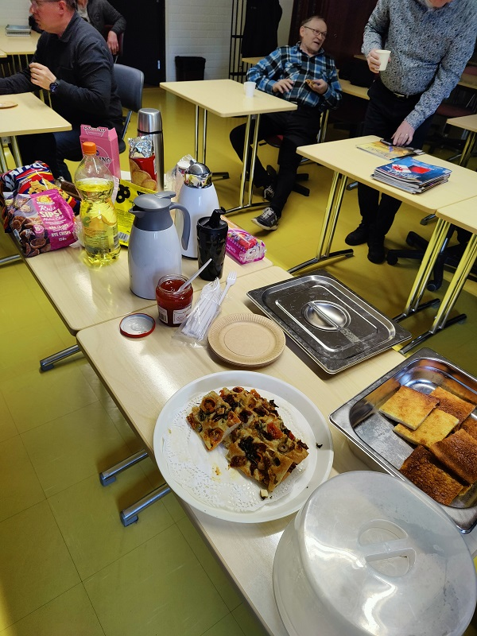
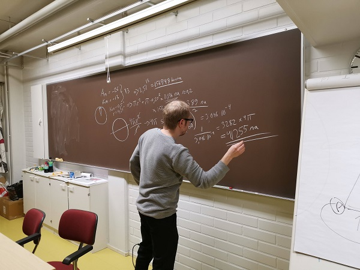
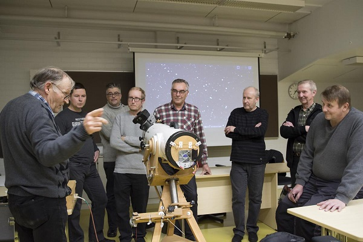
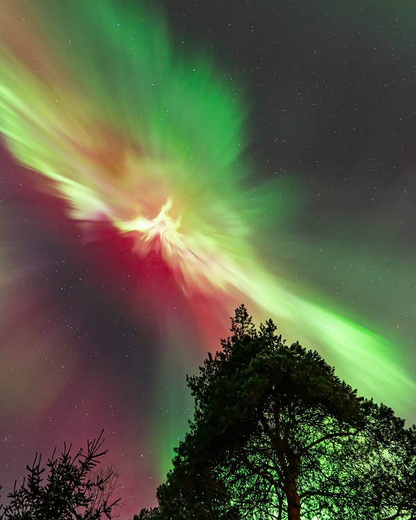
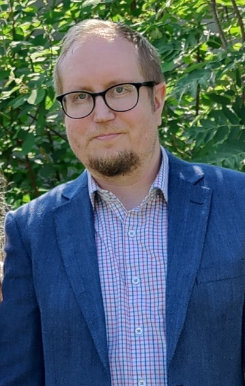

## Yleistä
Club Nebula on Ylivieskassa toimiva luonnontiedekerho, joka on avoin kaikille, joita kiinnostaa jokin tai useampi seuraavista osa-alueista:
* Tähtitiede
* Matematiikka
* Fysiikka
* Kemia
* Valokuvaus

Kerhon jäseniltä ei vaadita mitään pohjatietoja, vaan kerhon toimintaan voivat osallistua kaikki, joita yllä olevat asiat kiinnostavat. Kerho ei ole rekisteriöity yhdistys, vaan vapaamuotoinen ryhmittymä samasta aiheesta kiinnostuneita ihmisiä, jotka kokoontuvat säännöllisesti vaihtamaan ajatuksia ja ideoita. Kerhossa ei ole myöskään mitään jäsenmaksua eikä sitoumuksia jäsenille. Mikäli kerho järjestää reissuja tai tapahtumia, niihin osallistumisesta syntyvät kulut maksavat jäsenet itse.

 

## Puheenjohtaja
Kerhon puheenjohtajana on toiminut vuodesta 2017 alkaen Centria AMK:n tietotekniikan lehtori **Tero Niemi**. Terolla on pitkä historia niin tähtiharrastuksen kuin luonnontieteiden parissa. Tero on koulutukseltaan filosofian maisteri ja hän on lukenut pääaineena tietotekniikkaa sekä sivuaineena puhdasta matematiikkaa. Nykyään Tero opiskelee tohtorin tutkintoa Oulun yliopistossa, keskittyen tekoälyyn ja data-analyysiin. Välillä on kuitenkin aikaa kuvata taivaan tapahtumia Skymax 127mm Maksutov kaukoputkella.

 

## Kokoontuminen
Kerho kokoontuu kauden aikana (syys-touko) kerran kuukaudessa Centria ammattikorkeakoulu Oy:n Ylivieskan kampuksen tiloissa, osoitteessa Vierimaantie 7, 84100 Ylivieska. Kokoontumisaika on yleensä sillä viikolla, jolle sattuu kuun ensimmäinen maanantai klo 18-20 (kokoustilaan ohjaus pääovelta klo 18). Päivä kuitenkin vaihtelee paljon puheenjohtajan kiireiden vuoksi ja tarkka kokousaika ilmoitetaan aina Whatsapp-ryhmässä.

 

## Miten pääsee mukaan?
Mikäli kerhon toiminta kiinnostaa ja haluat tulla mukaan, ota rohkeasti yhteys Teroon sähköpostilla: tero.niemi[ät]centria.fi Yhteydenoton jälkeen sinut voidaan lisätä Club Nebulan Whatsapp -ryhmään, jossa kerhon jäsenet aktiivisesti keskustelevat aihepiirien asioista. Ryhmässä myös tiedotetaan seuraavista kokouksista niissä käsiteltävistä aiheista.

 

## Kuvia
  
Kerholla on aina tarjolla kahvia ja naposteltavaa....
  
  
Tässä lasketaan mielenkiintoista laskutehtävää...
  
  
Kerholaiset pyörii ihastelemassa Maunon kaukoputkea...
  
  
Revontulet. Copyright: Mika Pajala
  
  
Kerhon puheenjohtaja Tero Niemi
